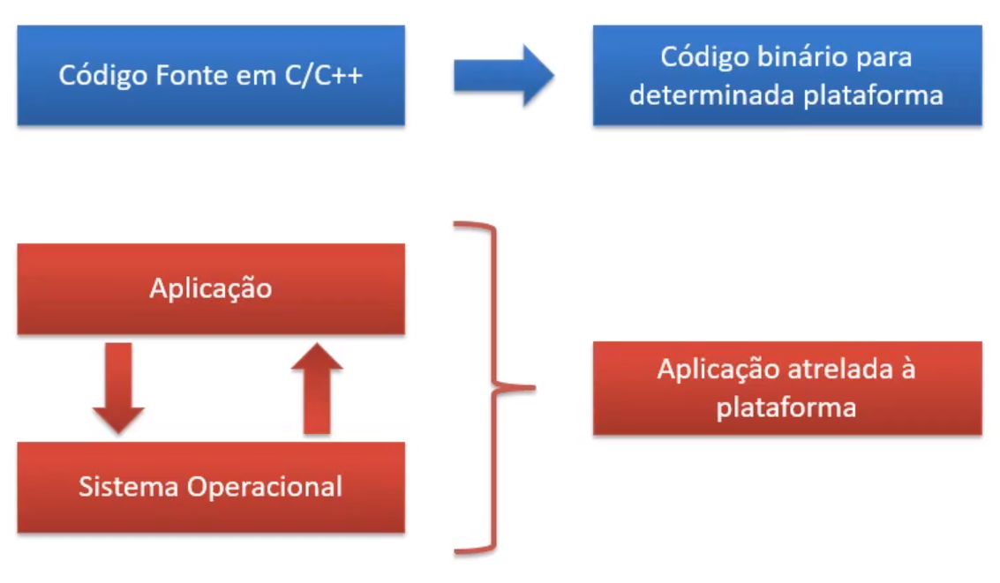
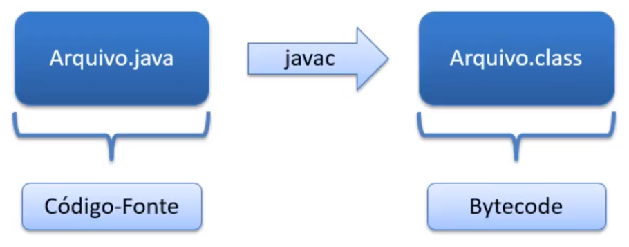
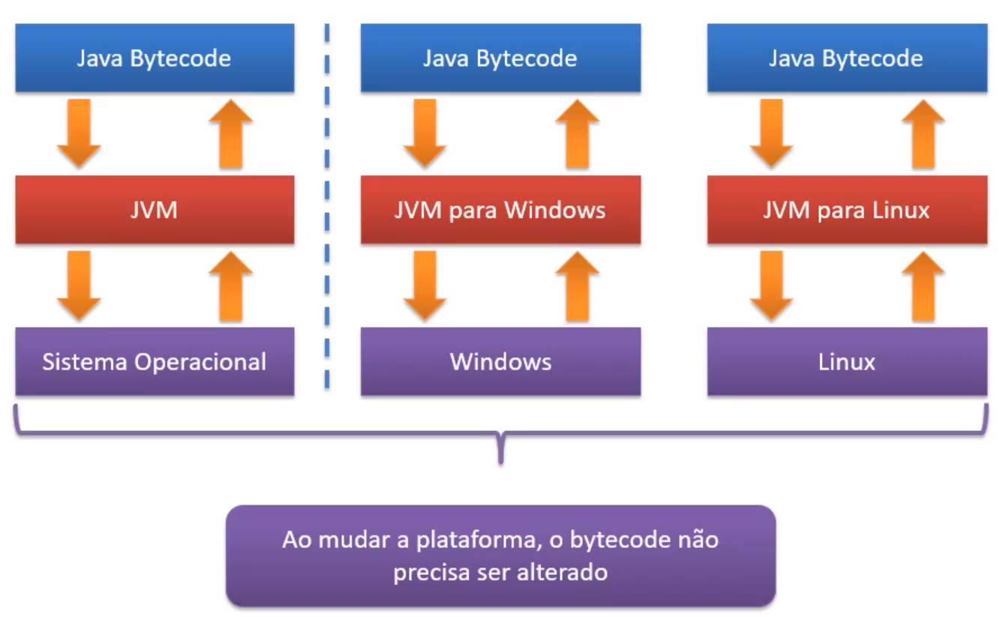
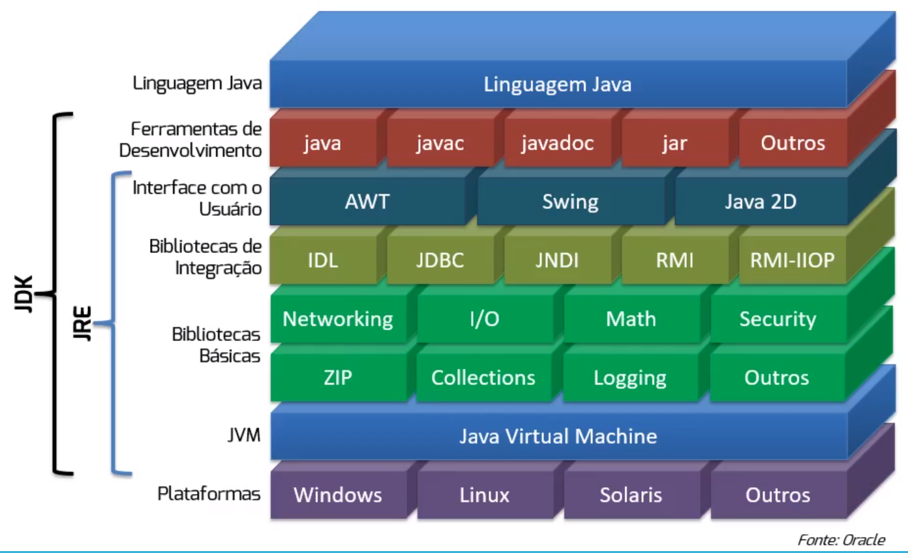

# Aula 1.1 - Introdução ao Java

Nesta aula, aprendi sobre:

## História do Java

    - Como tudo começou:
    Busca de inovações tecnológicas pela Sun (1992).
    Time liderado por James Gosling.
    Interpretador para trabalhar com diversos aparelhos eletrônicos (como videocassete, TV e aparelhos de TV a cabo).
    Esta ideia não funcionou.

    - O Java e a Internet:
    Com o aparecimento da Internet, a Sun resolveu usar sua ideia para rodar aplicações dentro dos browsers.
    Grande quantidade de sistemas operacionais e browsers.
    Na época os browsers só renderizavam HTML.
    Criação de applets.

    - No final das contas:
    Java nasceu com um objetivo.
    Foi lançado com outro objetivo.
    Firmou-se como tecnologia de desenvolvimento de aplicações no lado servidor.
    Em 2009, a Oracle comprou a Sun Microsystems e passou a cuidar do desenvolvimento da linguagem Java.

## JVM (Java Virtual Machine)

    - O que é:
    A Máquina Virtual é uma camada intermediária entre o sistema operacional e a aplicação.
    A aplicação se comunica apenas com a JVM.

    - Quando não existe JVM:
    Numa linguagem como C ou Pacal, o código é compilado para uma plataforma específica.
    Toda vez que a plataforma muda, é necessário recompilar o código.
    Às vezes é necessário até alterar o código (interfaces gráficas Windows x Linux).

    - A aplicação fica atrelada à plataforma sobre a qual ela executa:

## Bytecode

    O bytecode é uma linguagem entendida pela JVM.
    A geração do bytecode é feita através da compilação do código Java.

    Mesmo código entre plataformas.

## Vantagens da Máquina Virtual

    - Isolamento total da aplicação.
    - Como tudo passa pela JVM, é possível obter métricas e trabalhar com otimização.
    - Garbage collection.
    - Princípio WORA (Write Once, Run Anywhere).
    - Diversas empresas implementam a JVM, por esta ser uma especificação.
    - É possível trocar a JVM sem a necessidade de recompilar os códigos das aplicações.

## A performance do Java

    - A JVM usa dois elementos para otimizar a performance:
        - HotSpot (identifica código bastante executado); e
        - JIT - Just in Time Compiler (compila o código identificado pelo HotSpot para instruções nativas da plataforma).
    
    - Mito da performance:
        - "Java é uma linguagem com baixa performance".
        - Existem estudos que provam que o Java pode ser mais rápido em algumas situações do que C pu C++.

## Ramificações

    - Java SE (Standard Edition):
        - Base do Java.
        - Ambiente de execução e bibliotecas comuns.

    - Java EE (Enterprise Edition):
        - Aplicações corporativas e internet.

    - Java ME (Micro Edition):
        - Dispositivos móveis.

## Onde usar Java e onde não é necessário usar Java

    - Onde usar:
        - Aplicações de médio e grande porte.
        - Aplicações que virão a se expandir no futuro.
        - Ambientes heterogêneos.

    - Onde não é necessário usar:
        - Para pequenas aplicações com poucos desenvolvedores, outras linguagens podem ser mais produtivas.

    - Então, por quê adotar o Java?
        - Linguagem madura.
        - Extensa lista de bibliotecas gratuitas:
            - Manipulação de XML;
            - Logging;
            - Manipuladores de texto;
            - Geração de relatórios; etc.
        - Grande comunidade de desenvolvedores; e
        - Documentação farta.

## Nomenclaturas

    - JVM - Java Virtual Machine:
        - Máquina Virtual do Java; e
        - Instalar apenas a JVM não é possível.

    - JRE - Java Runtime Environment:
        - JVM + bibliotecas; e
        - Utilizada para executar aplicações Java.

    - JDK - Java Development Kit:
        - JRE + kit completo de desenvolvimento; e
        - Utilizado por pessoas desenvolvedoras para compilar e executar aplicações Java.

## Links úteis

- Link #1: <a href="https://docs.oracle.com/javase/tutorial/getStarted/index.html" target="_blank">Java Tutorials: Getting Started</a>
- Link #2: <a href="https://docs.oracle.com/en/java/javase/15/docs/api/index.html" target="_blank">Javadoc do Java 15</a>
- Link #3: <a href="http://download.softblue.com.br/certificacao-java.pdf" target="_blank">Guia para Certificação Java</a>