# Aula 3.1 - Programação Java - Conceitos Iniciais

Nesta aula, aprendi sobre:

## Variáveis

    - Declaração
        Variáveis devem possuir um tipo e um nome.

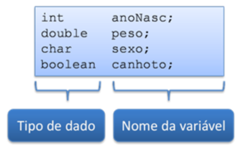
    
    - Inicialização
        Para inicializar variáveis, utilizamos o operador "=" (atribuição).

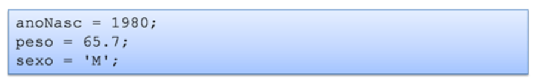

        É possível também declarar e inicializar simultaneamente

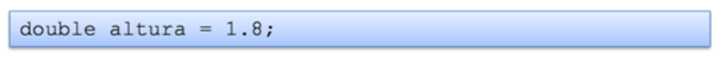

        O Java não inicializa as declaráveis automaticamente

    - Alteração de valor
        Outros exemplos de uso de variáveis

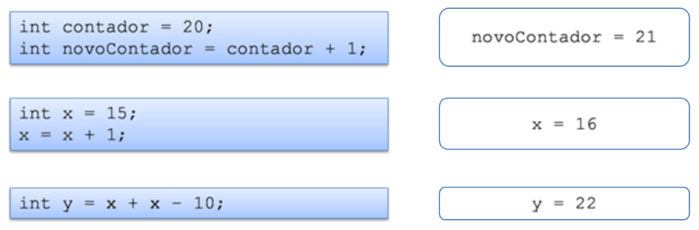

## Tipos primitivos do Java

    - Tipos primitivos
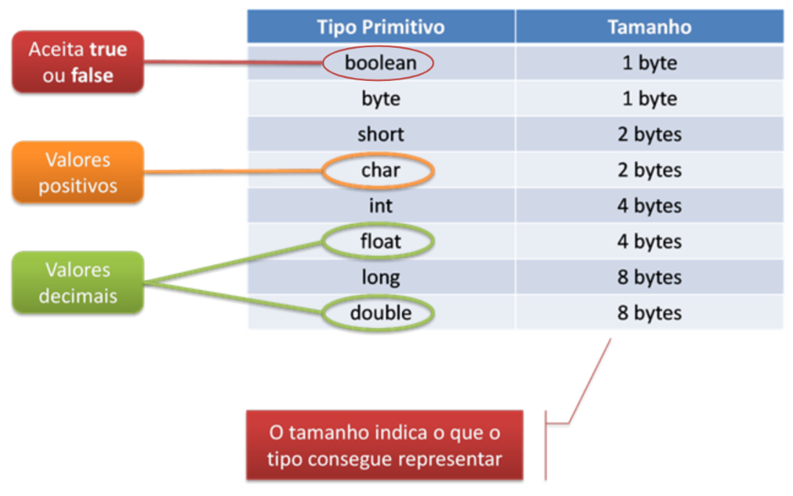

    - A variável var
        A partir do Java 10, é possível declarar uma variável como var.
        O tipo que a variável vai assumir vai depender do valor colocado nela:

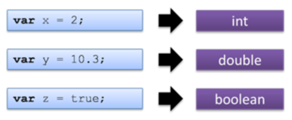

## Operadores

    - Aritméticos

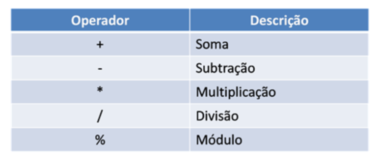

    - Comparação

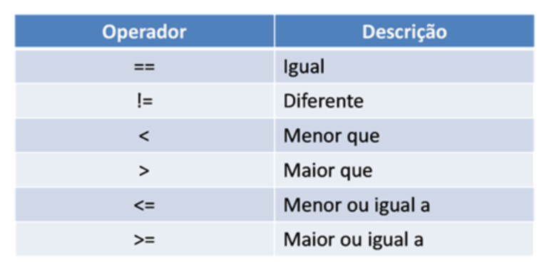

    - Lógicos

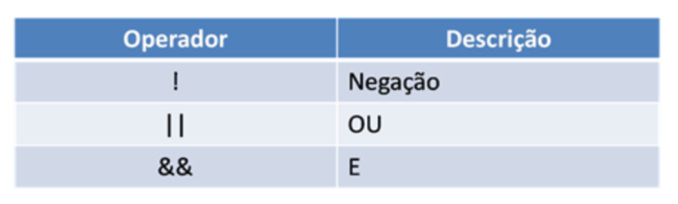

    - Outros operadores importantes

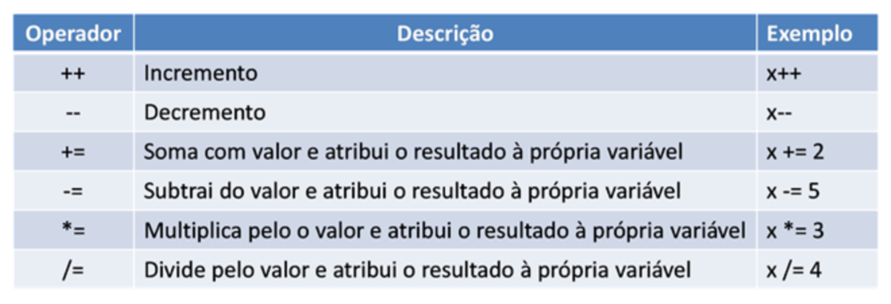

    - Operadores de Incremento e Decremento
        Os operadores de incremento ("++") e decremento ("--") podem ser de dois tipos:
            Pré-fixados (++x)
            Pós-fixados (x++)

    - Exemplo envolvendo incrementação:

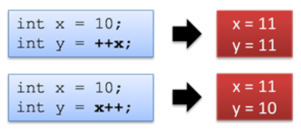

## Casting implícito e explícito

    - O casting consiste em atribuir uma variável/valor de um tipo a uma variável de outro tipo.
    - Podem ser implícitos ou explícitos.

    - Casting Implícito
        O Java faz a conversão do tipo de dado automaticamente:

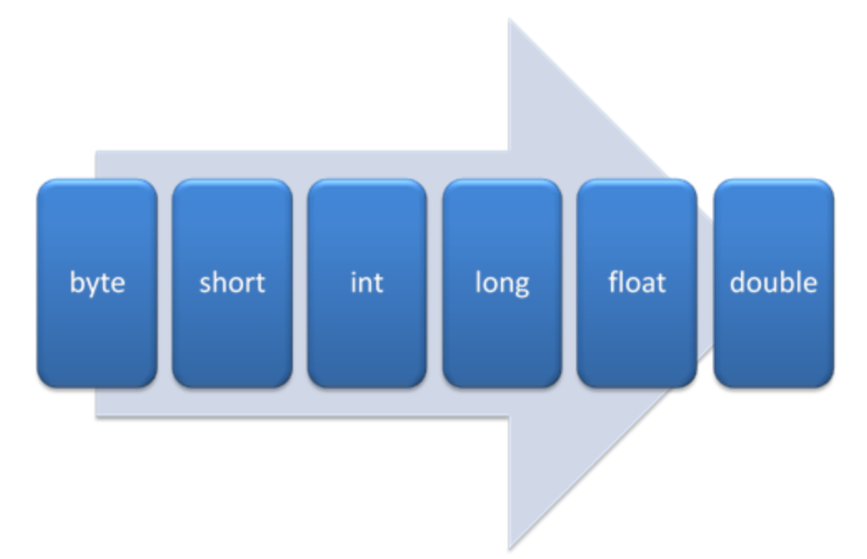

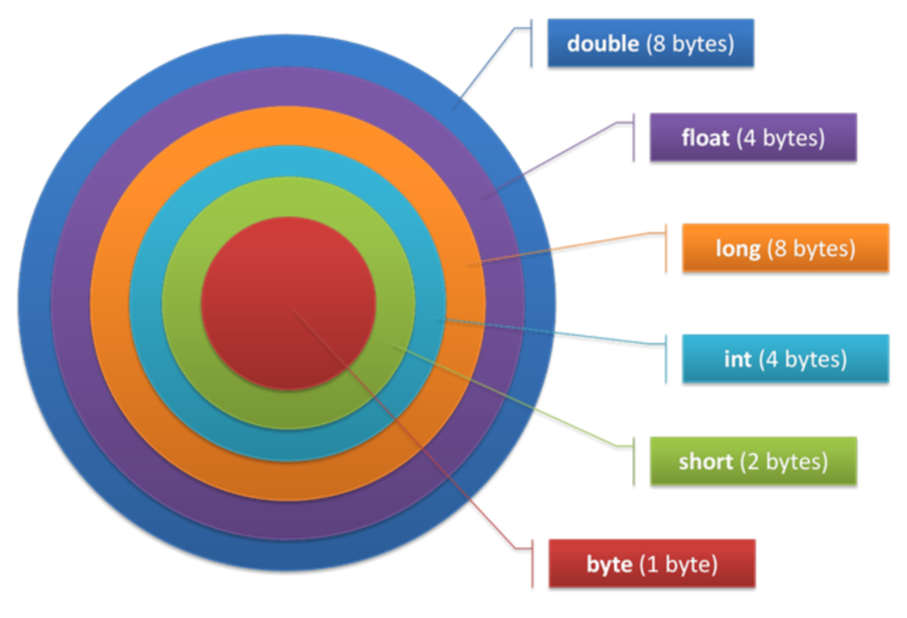

    - Exemplos de Casting Implícito:

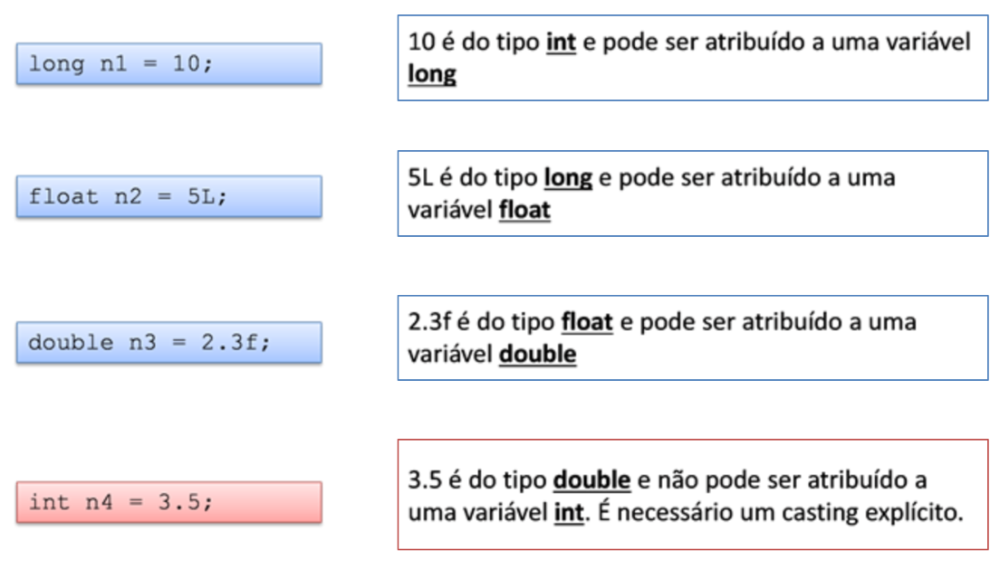

    - Casting Explícito
        A conversão deve ser feita pela pessoa programadora:

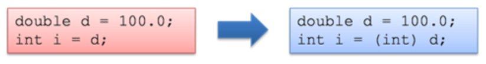

        Cuidado com o casting explícito:

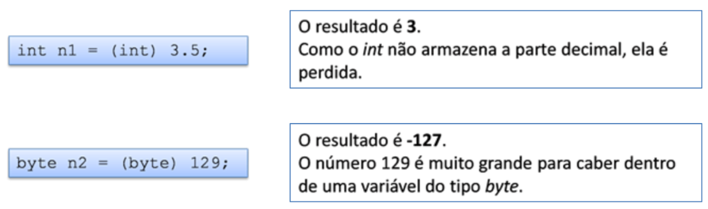

    - Exemplos de Casting Explícito
        Caso #1:
            Parte 1:

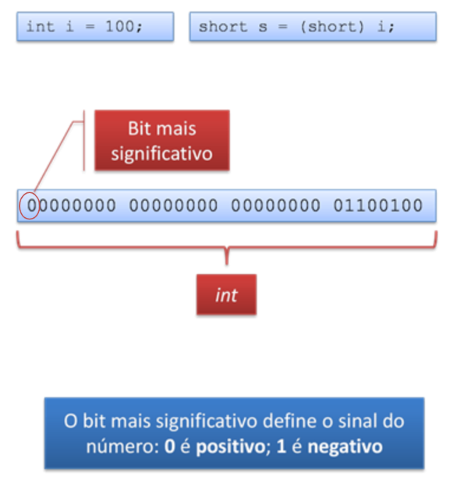

            Parte 2:

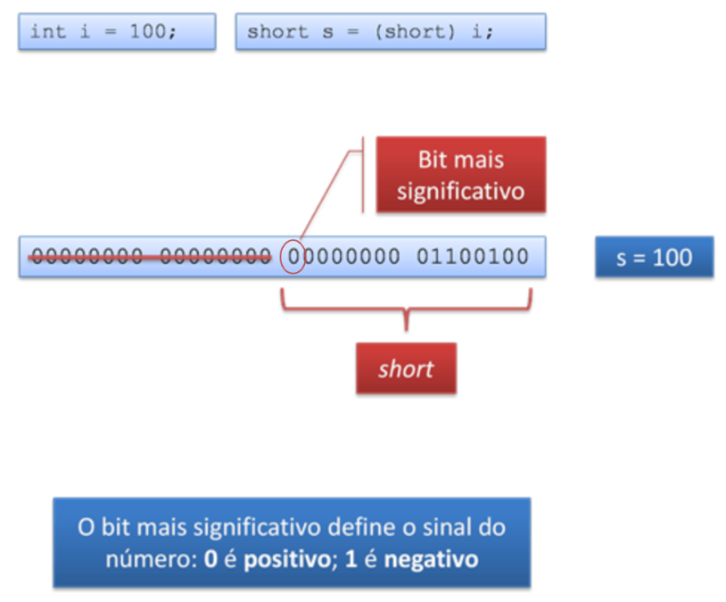

        Caso #2:
            Parte 1:

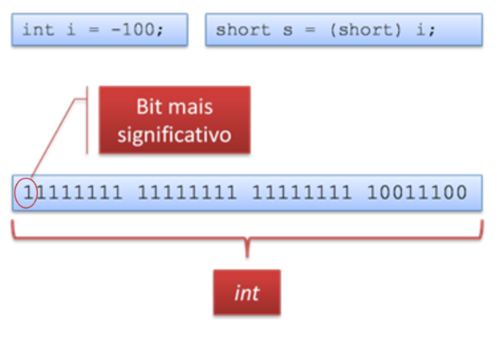

            Parte 2:

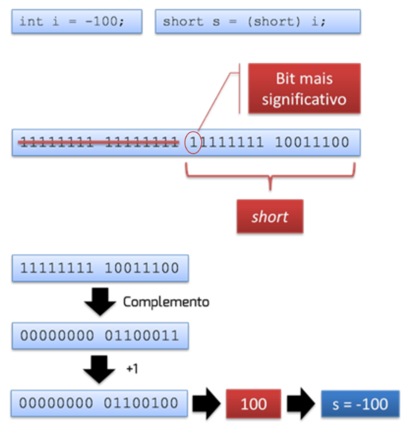

        Caso #3:
            Parte 1:

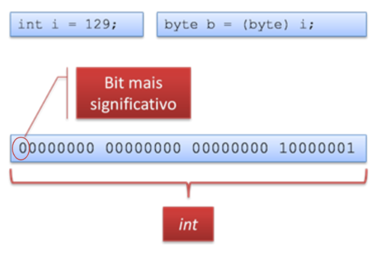

            Parte 2:

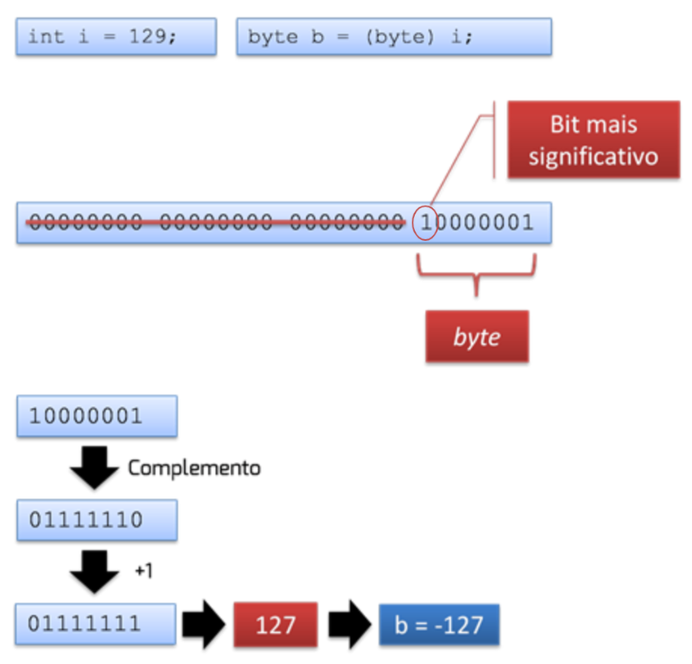


## O tipo de dados char

    - O char é o único tipo primitivo em Java sem sinal.
    - Um char indica um caractere, sendo utilizadas aspas simples na sua representação:
        char c = 'A';
    - A atribuição de números a um char também é válida:
        char c = 65; (Código ASCII do 'A')

    - O cast implícito ocorre a partir do tipo int

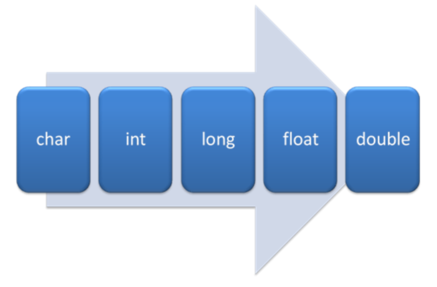

## Estruturas de controle

    - if-else
        Sintaxe básica:
```java
if (<condição_bolleana>) {
    <código_se_condição_verdadeira>;
}
```
        Opcionalmente, pode existir uma cláusula else:
```java
if (<condição_bolleana>) {
    <código_se_condição_verdadeira>;
} else {
    <código_se_condição_falsa>;
}
```

        A condição booleana pode ser qualquer expressão cujo resultado seja true ou false:
```java
int x = 50;

if (x > 30) {
    System.out.println("Número maior que 30");
} else {
        System.out.println("Número menor que 30");
}
```

        Outra possibilidade é utilizar o operador ternário para substituir o if-else:
```java
int x = 50;
boolean r;

if (x > 30) {
    r = true;
} else {
    r = false;
}

==========================
int x = 50;
boolean r;

r = x > 30 ? true : false;
```

    - switch
        A estrutura switch funciona de forma semelhante a um if-else:
```java
int i = 1;

switch (i) {
    case 1:
        System.out.println("Valor = 1");
        break;
    case 2:
        System.out.println("Valor = 2");
        break;
    default:
        System.out.println("Valor não reconhecido");
}
```

        A expressão avaliada pelo switch deve ser:
            - Um valor que possa ser convertido para int;
            - Um elemento de um enum;
            - Uma String.

        Caso o código entre num bloco case que não possua break, todos os cases abaixo serão executados até que um break seja encontrado.
            - Nessa situação, inclusive o bloco default é executado.

        O bloco default é semelhante ao bloco else.

    - while
        Repete determinado código enquanto uma condição for verdadeira.
        A condição é testada no início do bloco:
```java
int idade = 15;

while (idade < 18) {
    System.out.println(idade);
    idade = idade + 1;
}
```

    - do-while
        Semelhante ao while.
        A condição é testada no fim do bloco:
```java
int contador = 10;

do {
    System.out.println(contador);
    contador = contador +1;
} while (contador < 20);
```

    - for
        Semelhante ao while, mas possui seção para declaração de variáveis para o loop:
```java
for (int i = 0; i < 10; i++) {
    System.out.println(i);
}
```

```java
for (;;) {
    System.out.println("loop infinito");
}
```

    - break
        Permite forçar a saída de um loop:
```java
for (int i = 0; i < 10; i++) {
    if (i == 5) {
        break;
    }
    System.out.println(i);
}
```

    - continue
        Força o loop a executar o próximo passo:
```java
for (int i = 0; i < 10; i++) {
    if (i == 5) {
        continue;
    }
    System.out.println(i);
}
```

## Comentando código em Java

    - Comentários em uma linha (//):
```java
//exemplo de comentário no código em apenas uma linha
```

    - Comentários em múltiplas linhas (/**/):
```java
/*
Exemplo de comentário no código onde mais de uma linha 
pode ser utilizada
 */
```

## Links úteis

- Link #1: <a href="https://docs.oracle.com/javase/tutorial/java/nutsandbolts/index.html" target="_blank">Java Tutorials: Language Basics</a>
- Link #2: <a href="https://docs.oracle.com/javase/9/jshell/JSHEL.pdf" target="_blank">Java Shell User's Guide</a>
- Link #3: <a href="https://blogs.oracle.com/javamagazine/post/inside-java-13s-switch-expressions-and-reimplemented-socket-api" target="_blank">Inside Java 13's switch Expressions</a>