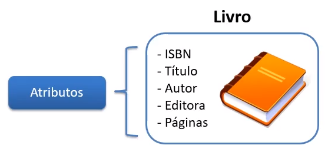
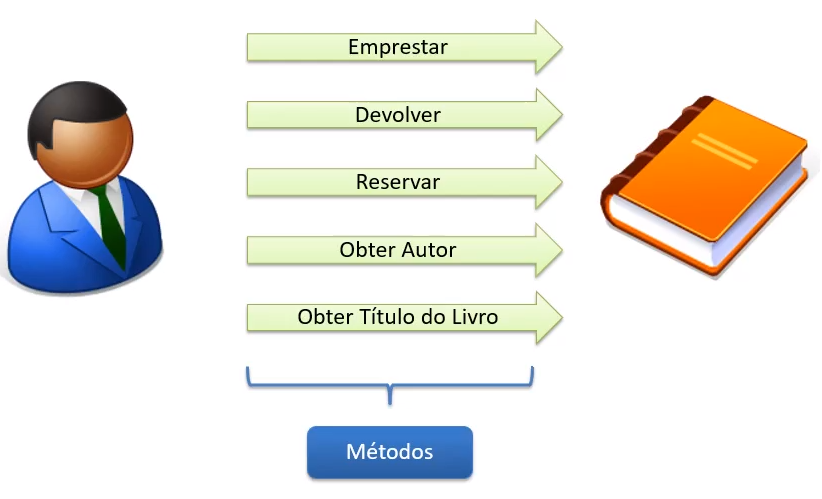
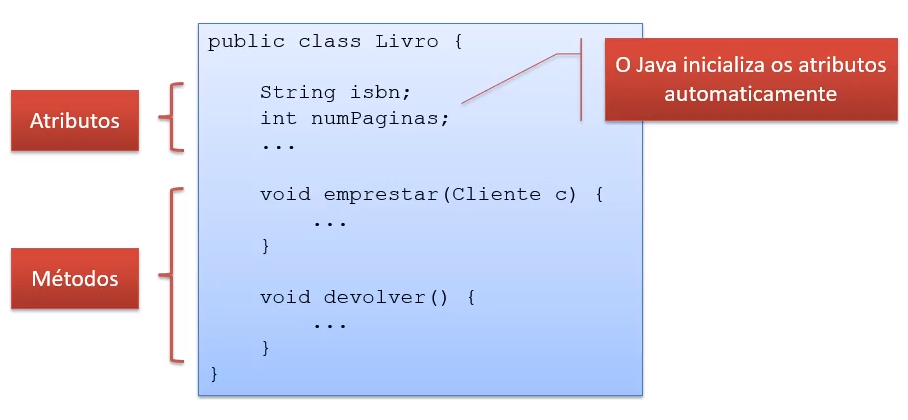
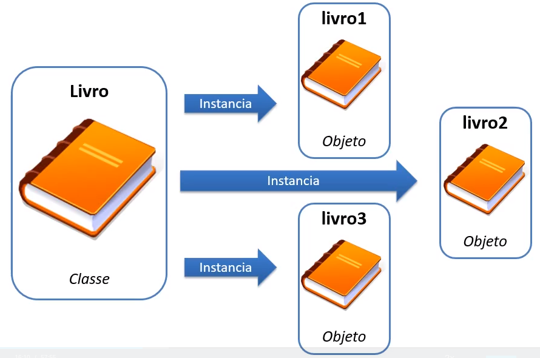
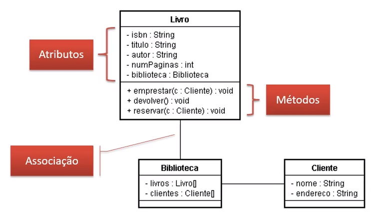
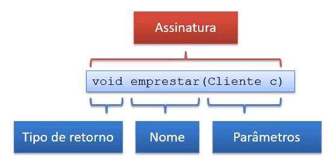
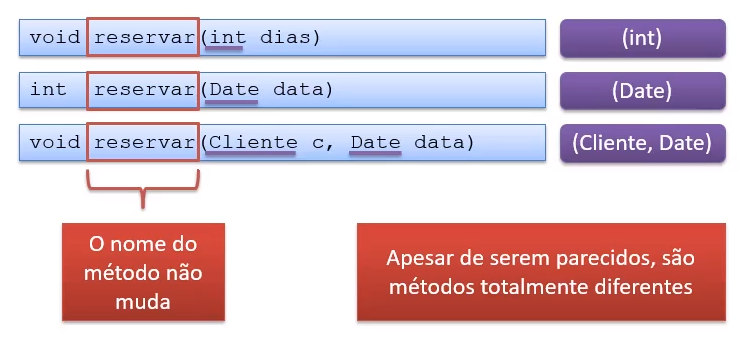
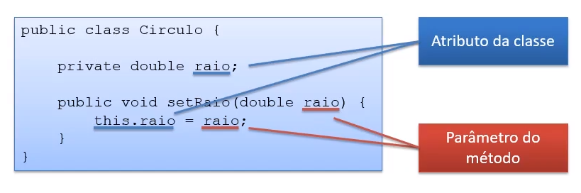

# Aula 4.1 - Classes e Objetos

Nesta aula, aprendi sobre:

## Programação procedural e orientada a Objetos

    - Programação Procedural
        - Problemas:
            Mudança de requisitos na aplicação;
            Mudança de pessoa desenvolvedora;
            Muitas pessoas responsáveis por colocar o mesmo código em vários lugares.

    - Orientação a Objetos
        - Benefícios:
            Escrever menos código;
            Concentrar responsabilidades nos locais certos;
            Flexibilizar a aplicação;
            Encapsular lógica de negócio;
            Polimorfismo (variação do comportamento).

## Classes

    - Uma classe representa um tipo de dados;
    - É uma estrutura.

    - Atributos e métodos:
        - Atributos:
            Características da classe;
            Representados por substantivos.



        - Métodos:
            Operações que a classe é capaz de realizar;
            Representados por verbos.



    - No Java, classes são declaradas utilizando a palavra class.
```java
public class Livro {...}
```

    - Um arquivo .java pode ter apenas uma classe declarada como pública dentro dele.

    - Atributos são variáveis declaradas dentro de cada classe, enquanto Métodos são consideradas funções dentro da classe:



## Classes x Objetos

    - A estrutura do Livro a qual nós nos referimos não representa um livro propriamente dito.
    - Ela é apenas uma estrutura (classe) usada como modelo para construir os livros propriamente ditos (objetos).

    - Classe e Objeto são conceitos diferentes!

    - Classes são usadas para instanciar objetos.



## Notação UML

    - Unified Modeling Language
        - Utilizada para documentar sistemas orientados a objetos;
        - Composta por diversos diagramas:
            Um deles é o Diagrama de Classes, que mostra as classes do sistema, juntamente com seus respectivos atributos.



## Métodos

    - Assinatura de um método:
        


        - Se o método não retornar valores, é utilizado o void;
        - Um método pode ter zero ou mais parâmetros e todo parâmetro deve ter um tipo definido.

## Sobrecarga de métodos

    - Sobrecarregar um método significa criar outros métodos com o mesmo nome, mas com assinatura diferente.



## Criando e manipulando Objetos

    - Um objeto é sempre instância de uma classe;
    - Para instanciar objetos é utilizado o new.
```java
Livro livro1 = new Livro();
Cliente cliente1 = new Cliente();
```

    - O objeto possui acesso ao que foi definido na sua estrutura (classe) através do "."
```java
livro1.titulo = "Aprendendo Java";
livro1.emprestar(cliente1);
```

    - Cada objeto criado com o new é único;
    - Os atributos de objetos diferentes pertencem apenas ao objeto:
```java
Livro livro1 = new Livro();
livro1.isbn = "1234";

Livro livro2 = new Livro();
livro2.isbn = "4321";

Livro livro3 = new Livro();
livro3.isbn = "1212";

// cada livro possui o seu próprio ISBN
```

## Objetos e referências

    - Uma variável cujo tipo é uma classe não guarda o objeto diretamente.
    - A variável guarda uma referência ao objeto;
    - O new aloca uma área de memória e retorna a referência da área de memória alocada;

    - Heap e Stack:
        - As variáveis declaradas em métodos são criadas numa área de memória chamada stack.
        - Os objetos são criados numa área de memória chamada heap.

## Garbage collector

    - Serviço da JVM que executa em segundo plano;
    - Procura objetos no heap que não são mais utilizados pela aplicação e os remove;
    - Não pode ser controlado pelo desenvolvedor.

## Operador this

    - Normalmente não é obrigatório;
    - Usado em basicamente duas situações:
        - Diferenciar um atributo do objeto de um argumento do método; e
        - Fornecer a referência do próprio objeto para outro método.




### Palavra de Otimismo!

    - Esse é o ponto do curso onde costumam surgir as maiores dificuldades:
        - O paradigma de orientação a objetos muda a forma de pensar.
    - A dificuldade é normal;
    - É preciso dedicação e prática para conseguir compreender;
    - Não tente entender tudo de uma vez só.

## Links úteis

- Link #1: <a href="https://docs.oracle.com/javase/tutorial/java/javaOO/index.html" target="_blank">Java Tutorials: Classes and Objects</a>