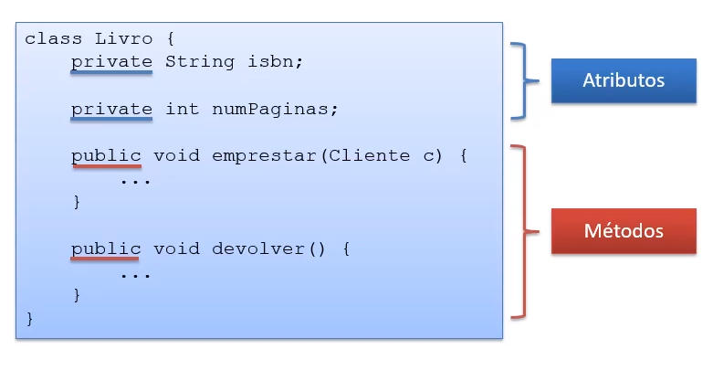
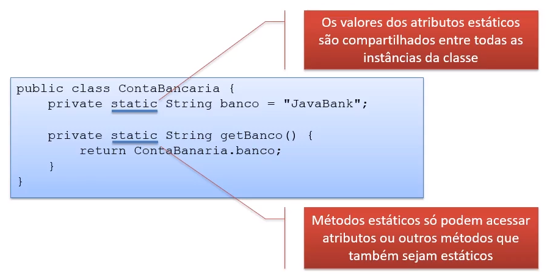
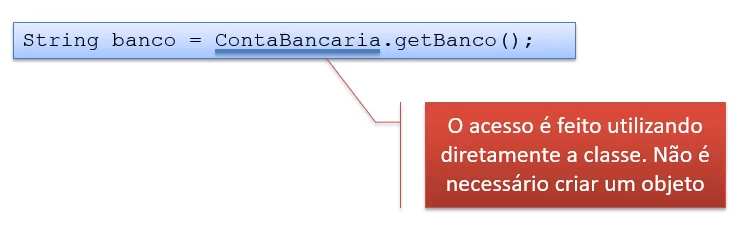

# Aula 5.1 - Modificadores de Acesso, Construtores e Elementos Estáticos

Nesta aula, aprendi sobre:

## Modificadores de acesso

    - O acesso a atributos e métodos é restringido através do uso de modificadores;
    - Alguns modificadores:
        private - Visível apenas para a classe que o declara;
        public - Vísivel a todas as classes.

    - Atributos e métodos
        - Marcar um atributo ou método como private esconde o atributo de quem usa a classe;
        - É interessante marcar métodos como private quando este é um método auxiliar da classe, que não deve ser acessível externamente.

        - Apesar de não ser regra, normalmente:
            Atributos são declarados como private;
            Métodos são declarados como public.
        - Esta abordagem faz sentido, já que o ideal é que objetos colaborem atráves de troca de mensagens (chamadas de métodos) e não atráves da manipulação direta de atributos.

    - Classes
        - Quase sempre, classes também são declaradas como public:
            Apenas uma classe definida como public pode existir num arquivo Java;
            O nome do arquivo deve ser igual ao nome da classe definida como public.
        - Classes não declaradas como public são chamadas inner classes.

## Princípio do encapsulamento

    - Encapsular é esconder detalhes de funcionamento do programa;
    - É fundamental para permitir que o programa seja suscetível a mudanças.

## Métodos getters e setters

    - Quando os atributos são declarados como private, getters e setters podem ser usados.
    - Getters:
        Usados para expor os valores de atributos;
    - Setters:
        Usados para alterar os valores de atributos.

    - Benefícios:
        - Protegem os atributos;
        - Evitam a mudança de código em vários lugares.
    - Não utilize getters e setters quando não for necessário.

    - Assinatura dos Getters e Setters:
        - A assinatura dos getters e setters segue um padrão:

## Construtores

    - Padrão e com parâmetros

    - Sobrecarga

## Atributos e métodos estáticos

    - O construtor de uma classe é chamado toda vez que um objeto da classe é instanciado
    - O construtor possui o mesmo nome da classe.

    - Criação de constantes
        - Quando o construtor não é fornecido, o Java fornece um construtor padrão (sem parâmetros)
        - Construtor com Parâmetros:
            - Construtores podem receber parâmetros da mesma forma que métodos

        - Sobrecarga de Construtores:

    - Algumas vezes, atributos e/ou métodos podem não estar atrelados a um objeto específico, mas sim à classe;
    - Atributos ou métodos da classe são assim definidos através do modificador static:

    - Invocando Elementos Estáticos:

    - Criação de Comstantes
        - Atributos estáticos são uma forma bastante usada para criar constantes no Java

    - Bloco static
        - Uma classe pode ter um bloco static;
        - O bloco static é executado quando a classe é referenciada pela primeira vez:
            Inicializar atributos estáticos;
            Executar um código antes que a classe seja utilizada.

## A classe System

    - A classe System do Java possui diversos métodos estáticos úteis:

## Links úteis

- Link #1: <a href="https://blogs.oracle.com/javamagazine/post/records-come-to-java" target="_blank">Records come to Java</a>