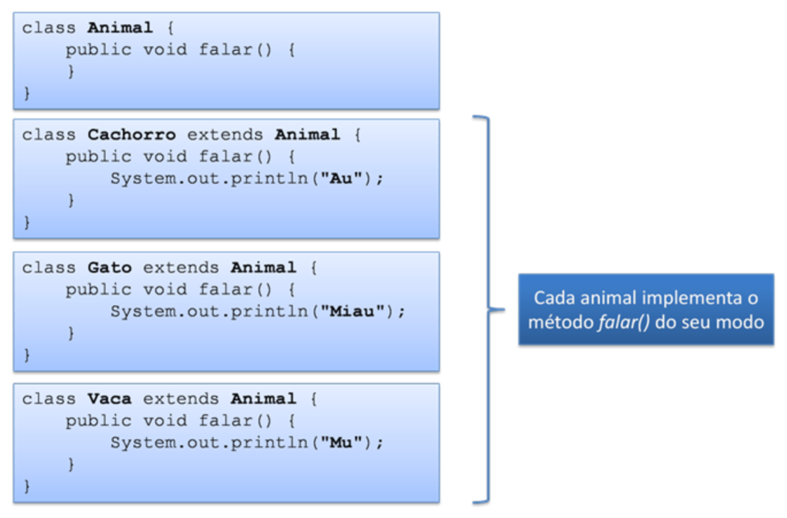

# Aula 6.1 - Herança e Polimorfismo

Nesta aula, aprendi sobre:

## Herança

    - A herança é um mecanismo que permite que uma classe possa herdar o comportamento de outra classe, ao mesmo tempo em que novos comportamentos podem ser estabelecidos.
    - A vantagem da herança é agrupar coisas comuns para poder reaproveitar código.

    - Herança da Classe Object
        - Toda classe em Java herda de apenas uma superclasse.

## O modificador protected

    - Atributos e métodos declarados com o modificador protected podem ser acessados pelas suas subclasses.

## Sobrescrita de métodos

    - Técnica também conhecida como overriding.
    - Quando uma classe herda de outra, ela pode redefinir métodos da superclasse, isto é, sobrescrever métodos:
        - Os métodos sobrescritos substituem os métodos da superclasse;
        - A assinatura do método sobrescrito deve ser a mesma do método original.

    - Método toString()
        - As classes podem sobrescrever este método para mostrarem uma mensagem que as representem;
        - O método System.out.println(), por exemplo, utiliza este método.
    - Método equals(Object)
        - É a forma que o Java tem de comparar objetos pelo seu conteúdo ao invés de comparar as referências (como acontece ao usarmos "==").

## A palavra-chave super

    - O método que foi sobrescrito pode ser acessado pelo método que o sobrescreveu através da palavra-chave super:

## Polimorfismo

    - É a capacidade que um método tem de agir de diferentes formas, dependendo do objeto sobre o qual está sendo chamado.
    - Quando ocorre a chamada de um método, a JVM decide qual método invocar dependendo do objeto instanciado na memória.
        - Exemplo 1:

        - Exemplo 2:

## O operador instanceOf

    - Utilizado para verificar se um objeto pertence à determinada classe.

## Links úteis

- Link #1: <a href="https://docs.oracle.com/javase/tutorial/java/concepts/index.html" target="_blank">Java Tutorials: Object-Oriented Programming Concepts</a>